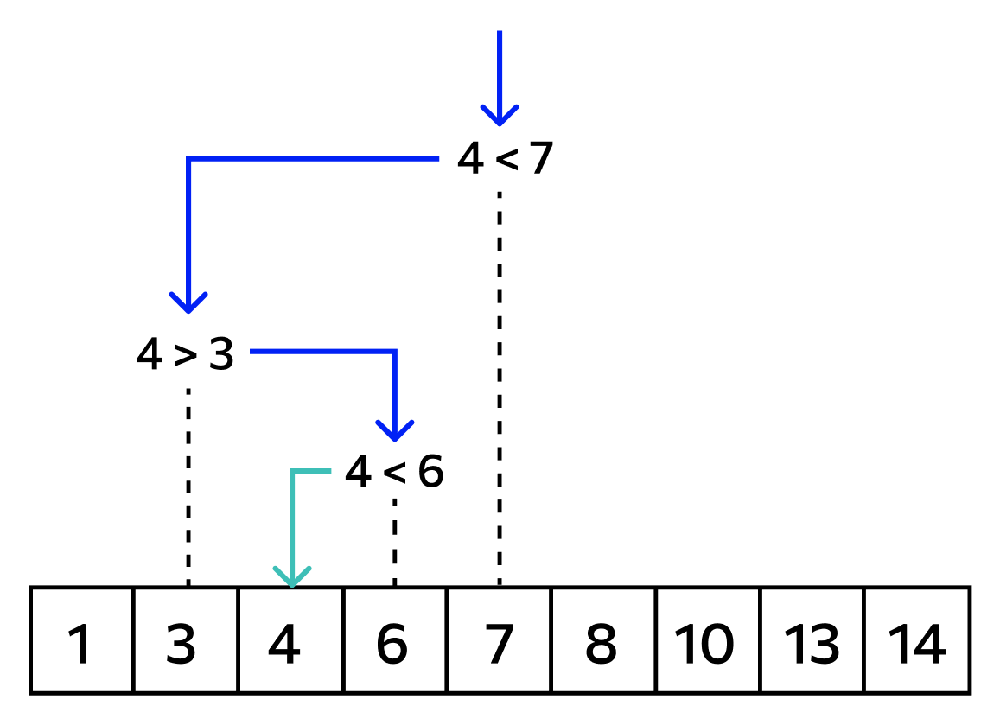
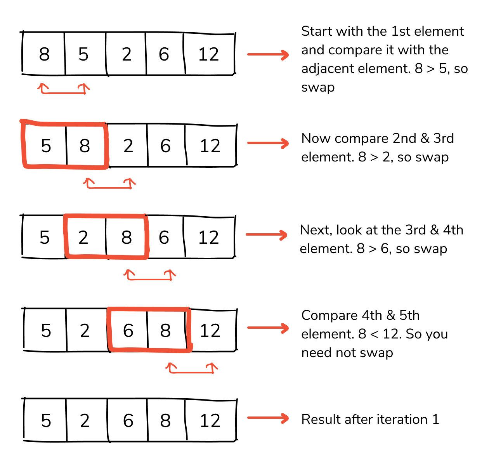

### Оглавление
- [Алгоритмы поиска](#Алгоритмы-поиска  )
- [Алгоритмы сортировки](#Алгоритмы-сортировки)
- [Рекурсия](#Рекурсия)

## Алгоритмы поиска  

### Линейный поиск  

Осуществляется методом последовательного перебора всех элементов массива, пока не найдет нужный или не пройдет по всему массиву.  

##### Сложность: O(N)

##### Линейный поиск на TypeScript:

```ts
function linearSearch<A>(list: Array<A>, item: A): A | null {
    for (let i = 0; i < list.length; i++) {
        if (list[i] === item) {
            return list[i]
        }
    }

    return null
}
```

##### Линейный поиск на python:

```py
def linearSearch (list, item):
    for i in range(len(list)):
        if (list[i] == item):
            return list[i]

    return None
```

## Двунаправленный поиск

Похож на обычный линейный поиск, но отличается тем, что последовательность поиска ведется сразу с двух направлений - с начала и с конца массива.  

##### Сложность: O(N/2)

##### Двунаправленный поиск на TypeScript:

```ts
function biDirectSearch<A>(list: Array<A>, item: A): A | null {

    let l: number = 0
    let r: number = list.length - 1

    while (l < list.length / 2) {
        if (list[l] === item) return list[l]
        if (list[r] === item) return list[r]

        l++
        r--
    }

    return null
}
```

##### Двунаправленный поиск на python:

```py
def biDirectSearch (list, item):

    l = 0
    r = 0
    
    while (l <= len(list) / 2):
        if (list[l] == item): return list[l]
        if (list[r] == item): return list[r]
            
        l += 1
        r -= 1

    return None
```

## Бинарный поиск

Массив делится на две части - левую и праую. Если искомое значение меньше, чем значение центрального элемента, то правая часть отбрасывается и поиск продолжается, только в левой. На следуйшей итерации операция повтаряется. Так до тех пор центральный элемент (указатель) не будет равен искомому или все элементы не будут проверены.  

##### сложность: O(LOG2N)  



##### бинарный поиск на TypeScript:    

```ts
function binarySearch<A>(list: Array<A>, item: A): number | null {

    let left:  number = 0
    let right: number = list.length

    let point: number

    while (true) {

        point = Math.floor( (left + right) / 2 )

        if (list[point] === item) {
            return point
        }
        if (left + 1 === right) {
            return null
        }

        if (item < list[point]) {
            right = point
        }
        else {
            left = point
        }
    }
}
```

##### бинарный поиск на python:  

```py
def binarySearch(list, item):

    left  = 0
    right = len(list)

    point = None

    while (True):

        point = round((left + right) / 2)

        if (list[point] == item):
            return point
        if (left + 1 >= right):
            return None


        if (item < list[point]):
            right = point
        else:
            left = point
```

## Алгоритмы сортировки

### Пузырьковая сортировка  

Алгоритм сортировки при котором элемент итерации сравнивается со следуйщим элементом массива и если он больше следуйшего, то они меняются местами. 

##### сложность: O(N^2)  



##### пузырьковая сортировка на TypeScript:  

```ts
function bubleSort (list: Array<number>): Array<number> {
    for (let i = 0; i < list.length; i++) {
    
        for (let j = 0; j < list.length; j++) {
            if (list[j] > list[j + 1]) {
                let temp = list[j + 1]

                list[j + 1] = list[j]
                list[j]     = temp
            }
        }
        
    }

    return list
}
```

## Рекурсия  

### Факториал  

Рекурсивная функция факториала на TypeScript:  

```ts
function factorial (num: number): number {
    
    if (num === 1) {
        return num
    }

    return num * factorial__REQ(num - 1)
}
```  

Вычисление факториала итеративнм способом:  

```ts
function factorial__LOOP_A (num: number): number {

    let result: number = 1

    for (let i = 1; i <= num; i++) {
        result *= i
    }

    return result
}

function factorial__LOOP_B (num: number): number {

    let result: number = 1

    for (let n = num; n >= 0; n--) {
        result *= n
    }

    return result
}
```
